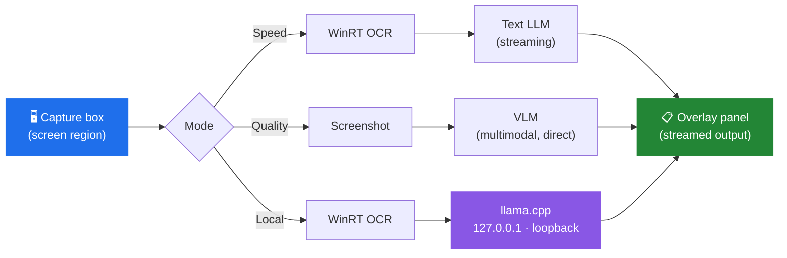

<div align="center">


# OverlayTrans

**Immersive AI screen translator for Visual Novels and foreign-language video.**

Keep a transparent capture box over your game, press one key, and read the translation
where the subtitles already are — without ever leaving fullscreen.

[](https://github.com/KaiyuanGONG/OverlayTrans/releases/latest)
[](https://github.com/KaiyuanGONG/OverlayTrans/releases)
[](#requirements)
[](LICENSE)
[](https://tauri.app/)

[**Download**](https://github.com/KaiyuanGONG/OverlayTrans/releases/latest) ·
[Quick Start](#quick-start) ·
[How It Works](#how-it-works) ·
[Build from Source](#build-from-source) ·
[中文说明](README.zh-CN.md)

</div>

<!--
TODO(asset): hero demo GIF.
Once you have it, uncomment the block below and drop the file at docs/assets/demo.gif

Recommended: 10-15s, <= 5 MB, 10-12 fps, recorded with ScreenToGif.
Storyboard: drag the capture box over subtitles -> press F8 -> translation streams in word by word.

<div align="center">
  
</div>
-->

---

## Why OverlayTrans

Most screen translators make you alt-tab, paste a screenshot somewhere, or accept a
machine-translated wall of text that ignores who is speaking. OverlayTrans stays on top of
your game, remembers the last few lines of dialogue so pronouns and honorifics stay
consistent, and streams the translation in as it is generated instead of making you wait
for a finished paragraph.

It also ships a genuinely offline path. Not "offline-ish" — in Local mode the app never
reads your remote API configuration at all.

## Features

- **Three translation modes** — trade latency for quality per title, see [the comparison below](#the-three-modes).
- **Bring your own provider** — DeepSeek, Qwen, Gemini, Groq, OpenAI, or any OpenAI-compatible endpoint (Ollama, LM Studio, vLLM, …).
- **Context-aware** — the model sees recent dialogue history, so pronouns, names, and tone stay stable across lines.
- **Streaming output** — text appears token by token; you start reading before the line finishes.
- **True offline mode** — bundled llama.cpp runtime over loopback, with no remote fallback path.
- **Transparent overlay** — click-through capture box that floats above fullscreen games.
- **Bilingual UI** — English and Chinese, with light / dark / system themes.
- **Source languages** English, Chinese, Japanese → **target languages** Chinese, English, Japanese.

## Screenshots

<!--
TODO(asset): replace this section with real screenshots.

Capture from an INSTALLED release build (not `npm run tauri dev`), and scrub API keys,
local paths, and usernames before committing. Full contract: docs/assets/README.md

Suggested set (2-4 images max — more than that and nobody scrolls):
  docs/assets/capture-overlay.png    the overlay sitting on top of an actual game
  docs/assets/settings-modes.png     the three-mode selector in Settings
  docs/assets/local-model.png        Local mode model management

Then uncomment:

<table>
  <tr>
    <td width="50%"></td>
    <td width="50%"></td>
  </tr>
  <tr>
    <td align="center"><sub>Overlay above a running game</sub></td>
    <td align="center"><sub>Choosing a translation mode</sub></td>
  </tr>
</table>
-->

> Release screenshots are being prepared. See [`docs/assets/README.md`](docs/assets/README.md)
> for the naming and review contract.

## Installation

Grab the latest installer from the [Releases page](https://github.com/KaiyuanGONG/OverlayTrans/releases/latest):

| File | Notes |
|------|-------|
| `OverlayTrans_x.y.z_x64-setup.exe` | NSIS installer — recommended for most users |
| `OverlayTrans_x.y.z_x64_en-US.msi` | MSI package — for managed / scripted deployment |

Both bundle the llama.cpp runtime required by Local mode.

Windows SmartScreen will warn about an unrecognized publisher, because the binaries are not
code-signed (a certificate costs several hundred USD per year for a free project). Choose
**More info → Run anyway**, or verify the checksum published in the release notes first.

### Requirements

- Windows 10 (1809+) or Windows 11 — OCR uses the Windows Runtime OCR engine
- The Windows OCR language pack for whichever source language you translate
  (*Settings → Time & language → Language & region → your language → Language options*)
- An API key from any supported provider — **or**, for Local mode, about 3 GB of free disk space for the default 4B model (about 6 GB for the 8B model)
- Local mode requires an AVX2-compatible processor with FMA, F16C, and BMI2; Speed and Quality modes are unaffected

## Quick Start

1. **Launch OverlayTrans.** A five-step onboarding walks you through mode and provider setup.
2. **Pick a mode** — start with Speed if you are unsure.
3. **Add your API key** in *Settings → API* — or, for Local mode, download a model and start the runtime in *Settings → Translation*.
4. **Drag the capture box** over the subtitle or dialogue area of your game.
5. **Press `F8`** to translate the current frame, or turn on **Auto** for continuous translation.

> The capture box is click-through while you play — it will not steal mouse input from the game.

## How It Works



Every capture run is tagged with a new, monotonically increasing **generation ID**, and switching
modes or changing any setting that affects meaning (languages, provider, endpoint, model, context
size) advances it as well. The frontend discards in-flight results from older generations. This is
what stops a slow response from overwriting a newer line — the classic failure mode of naive
streaming overlays.

A change detector compares consecutive captures and skips the whole pipeline when the region
has not meaningfully changed, so Auto mode does not burn tokens re-translating a static frame.

### The three modes

| | **Speed** | **Quality** | **Local** |
|---|---|---|---|
| **Pipeline** | OCR → text model | Screenshot → VLM | OCR → llama.cpp |
| **Latency** | Lowest | Higher | Depends on hardware |
| **Network** | Provider API | Provider API | None after model download |
| **Cost** | Cheapest tokens | Image tokens are pricier | Free |
| **Best for** | Clean, horizontal text | Stylized fonts, vertical Japanese, dense layouts | Privacy, offline play, no API budget |

**Why two different remote pipelines?** OCR is fast and cheap, but Windows OCR degrades badly
on decorative fonts, vertical Japanese text, and text over busy artwork — exactly what
Visual Novels are full of. Quality mode skips OCR entirely and hands the raw image to a
multimodal model, which reads layout and styling directly. You pay for that in latency and
image tokens, so it is a per-title choice rather than a global default.

**When Quality fails.** If an image request fails at runtime (timeout, provider error), OverlayTrans
retries that frame once through the Speed pipeline and shows a warning in the translation panel.
Configuration errors, such as a missing image model or key, are reported instead of falling back.

**What "Local" actually guarantees.** Local mode does not read your remote provider
configuration, and there is no fallback path back to the network — if the local runtime fails,
the translation fails loudly instead of quietly shipping your screen to a third party.
The bundled Local runtime requires an AVX2-compatible processor with FMA, F16C, and BMI2.
Speed and Quality modes are unaffected by this CPU requirement.

### Architecture

Tauri 2 shell, Rust + Tokio backend, React 18 + TypeScript frontend.

| Layer | Technology |
|-------|-----------|
| Shell / packaging | Tauri 2 (MSI + NSIS) |
| Backend | Rust, Tokio async runtime |
| OCR | Windows Runtime `Windows.Media.Ocr` — no model download, no bundled engine |
| Screen capture | Windows GDI |
| Local inference | llama.cpp sidecar, GGUF models pinned to a fixed revision + SHA |
| Frontend | React 18, TypeScript, Vite, TailwindCSS, Zustand |

Full module map, event contract, and configuration schema: [`docs/ARCHITECTURE.md`](docs/ARCHITECTURE.md).

## Provider Configuration

| Provider | Text models | VLM (Quality mode) | Notes |
|----------|------------|--------------------|-------|
| **DeepSeek** | `deepseek-v4-flash`, `deepseek-v4-pro` | — | Default; best price/performance for text |
| **Qwen** | `qwen3.6-flash`, `qwen3.6-plus`, `qwen3.7-plus` | same | Mainland China & international endpoints |
| **Gemini** | `gemini-3.1-flash-lite`, `gemini-3.5-flash` | same | Strong multimodal quality |
| **Groq** | `openai/gpt-oss-20b`, `qwen/qwen3.6-27b`, `openai/gpt-oss-120b` | — | Very fast inference |
| **OpenAI** | `gpt-5.4-nano`, `gpt-5.4-mini` | `gpt-5.4-mini` | |
| **Custom** | Any OpenAI-compatible | Optional | Ollama, LM Studio, vLLM, self-hosted |

Quality mode uses the *Image Translation* settings in *Settings → API*: either follow the text
provider or configure a separate image provider, model and key.

Local mode runs Qwen3 4B or 8B (Q4_K_M GGUF) on the bundled llama.cpp runtime, or connects to your
own loopback server. For safety, custom loopback endpoints are restricted to `127.x`,
`localhost`, and `::1`.

## Build from Source

**Prerequisites** — Windows 10/11, [Node.js](https://nodejs.org/) 20.19+ (or 22.13+ / 24+),
[Rust](https://www.rust-lang.org/tools/install) stable with the MSVC toolchain, and Visual Studio 2022
Build Tools with the *Desktop development with C++* workload (MSVC and CMake). Building the llama.cpp
sidecar also needs network access and an AVX2-capable CPU.

```bash
git clone https://github.com/KaiyuanGONG/OverlayTrans.git
cd OverlayTrans

npm ci
node scripts/prepare-sidecar.mjs   # build the pinned llama.cpp sidecar from source (once)

npm run tauri dev                  # development
npm run tauri build                # production installers
```

`src-tauri/binaries/` is git-ignored, so run `prepare-sidecar.mjs` before any `cargo` or `tauri`
command on a fresh clone. Installers land in `src-tauri/target/release/bundle/`.
Packaging details and release validation: [`docs/PACKAGING_WINDOWS.md`](docs/PACKAGING_WINDOWS.md).

### Tests

```bash
npm run test                                               # frontend and build-script tests (Vitest)
cargo test --locked --manifest-path src-tauri/Cargo.toml   # Rust
```

The full pre-release gate (formatting, Clippy, license reports) is listed in
[`docs/PACKAGING_WINDOWS.md`](docs/PACKAGING_WINDOWS.md).

## FAQ

**OCR returns nothing / garbage.**
The Windows OCR language pack for your source language is probably missing — install it under
*Settings → Time & language → Language & region*. If text is stylized or vertical, switch to
Quality mode; that is exactly the case it exists for.

**The overlay does not show above my game.**
Fullscreen-exclusive mode can block overlays. Switch the game to *borderless windowed*.

**Can I use it for anime or streaming video?**
Yes — anything rendered on screen works, including video players and browsers.

**Does it work on macOS or Linux?**
No. OCR depends on the Windows Runtime OCR engine, and capture uses Windows GDI. Porting
would mean replacing both.

**Is my API key sent anywhere?**
No. It is stored in `%APPDATA%\OverlayTrans\config.json` and used only to call the provider you
configured. See [Privacy](#privacy).

**Which mode should I pick?**
Speed for most horizontal text, Quality when OCR struggles, Local when you want no network
or no API bill.

## Roadmap

- [x] Three translation modes (Speed / Quality / Local)
- [x] Streaming output with generation-tagged events
- [x] Japanese source language support
- [x] Bundled llama.cpp offline runtime
- [ ] Korean source language
- [ ] Per-game profiles (capture geometry + mode + provider)
- [ ] Translation history and export
- [ ] Custom glossary / term pinning

Ideas and votes are welcome in [Issues](https://github.com/KaiyuanGONG/OverlayTrans/issues).

## Privacy

- **API keys** are stored only in your user profile (`%APPDATA%\OverlayTrans\config.json`). They are never transmitted anywhere except to the provider you configured.
- **Local mode** downloads the GGUF model you select only when you click *Download Model*. After that, translation runs against the bundled llama.cpp runtime over loopback (`127.0.0.1`); no source text and no screenshots leave your machine.
- **Speed / Quality modes** send recognized text (or, for Quality, the captured image) to your chosen provider under your own account and their terms. If a Quality request fails at runtime, the one-time Speed retry sends the recognized text to your text provider.
- **No telemetry.** OverlayTrans has no analytics, no crash reporting, and no developer-operated servers. The maintainers receive nothing.

## Contributing

Bug reports and pull requests are welcome — see [CONTRIBUTING.md](CONTRIBUTING.md).
When filing a bug, please include your Windows version, OverlayTrans version, the translation
mode, and the provider in use.

## Acknowledgements

OverlayTrans stands on:

- [Tauri](https://tauri.app/) — the desktop shell and packaging toolchain (MIT / Apache-2.0)
- [llama.cpp](https://github.com/ggml-org/llama.cpp) — local inference runtime (MIT)
- [Qwen](https://github.com/QwenLM) — the GGUF models offered in Local mode (Apache-2.0)
- [React](https://react.dev/), [Vite](https://vite.dev/), [TailwindCSS](https://tailwindcss.com/), [Zustand](https://github.com/pmndrs/zustand)

## License

Source code is released under the [MIT License](LICENSE).

The OverlayTrans name, chameleon logo, application icons, and installer branding are not covered by the MIT License. Their use is governed by the [Trademark and Brand Policy](TRADEMARKS.md). Forks and modified distributions must use different branding.
