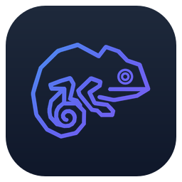
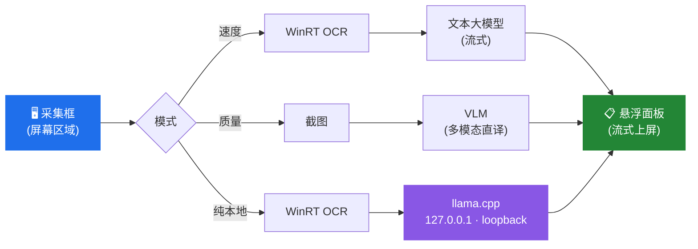

<div align="center">



# OverlayTrans

**沉浸式 AI 屏幕翻译工具，为视觉小说与外语视频而生。**

在游戏画面上放一个透明采集框，按一下快捷键，
翻译就出现在字幕原本的位置——全程不用退出全屏。

[](https://github.com/KaiyuanGONG/OverlayTrans/releases/latest)
[](https://github.com/KaiyuanGONG/OverlayTrans/releases)
[](#运行环境)
[](LICENSE)
[](https://tauri.app/)

[**下载安装包**](https://github.com/KaiyuanGONG/OverlayTrans/releases/latest) ·
[快速上手](#快速上手) ·
[工作原理](#工作原理) ·
[从源码构建](#从源码构建) ·
[English](README.md)

</div>

<!--
TODO(asset): 首屏演示 GIF。
素材准备好后，把文件放到 docs/assets/demo.gif，然后取消下面这段的注释。

建议规格：10-15 秒，不超过 5 MB，10-12 fps，用 ScreenToGif 录制。
分镜：拖动采集框对准字幕 → 按 F8 → 译文逐字流式出现。

<div align="center">
  
</div>
-->

---

## 为什么做这个

大多数屏幕翻译工具都要你切出游戏、把截图贴到别处，或者接受一段无视说话人是谁的机翻。
OverlayTrans 常驻在游戏之上，会记住前几句对话，让人称、称谓和语气在整段剧情里保持一致，
并且边生成边上屏，而不是让你干等一整段翻完。

它还提供了一条真正的离线路径。不是"基本离线"——纯本地模式下，程序根本不会去读你的远程 API 配置。

## 功能特性

- **三档翻译模式** — 按作品在延迟和质量之间取舍，[详见对比](#三档模式对比)。
- **自带服务商** — DeepSeek、Qwen、Gemini、Groq、OpenAI，或任意 OpenAI 兼容接口（Ollama、LM Studio、vLLM 等）。
- **上下文感知** — 模型能看到最近的对话历史，人称、人名和语气在多行之间保持稳定。
- **流式输出** — 译文逐字上屏，不用等整句生成完。
- **真正的离线模式** — 内置 llama.cpp 走 loopback，且不存在回退到网络的路径。
- **透明悬浮框** — 鼠标穿透的采集框，可浮于全屏游戏之上。
- **中英双语界面** — 支持浅色 / 深色 / 跟随系统主题。
- **源语言** 英语、中文、日语 → **目标语言** 中文、英语、日语。

## 应用截图

<!--
TODO(asset): 用真实截图替换本节。

请从**已安装的正式版**截图（不要用 `npm run tauri dev`），并在提交前抹掉 API Key、
本地路径和用户名。完整规范见 docs/assets/README.md

建议这几张（最多 2-4 张，再多就没人往下翻了）：
  docs/assets/capture-overlay.png    悬浮框叠在真实游戏画面上
  docs/assets/settings-modes.png     设置里的三模式选择
  docs/assets/local-model.png        纯本地模式的模型管理

然后取消下面这段的注释：

<table>
  <tr>
    <td width="50%"></td>
    <td width="50%"></td>
  </tr>
  <tr>
    <td align="center"><sub>浮于运行中的游戏之上</sub></td>
    <td align="center"><sub>选择翻译模式</sub></td>
  </tr>
</table>
-->

> 正式发布截图正在准备中，命名与审核规范见 [`docs/assets/README.md`](docs/assets/README.md)。

## 安装

从 [Releases 页面](https://github.com/KaiyuanGONG/OverlayTrans/releases/latest) 下载最新安装包：

| 文件 | 说明 |
|------|------|
| `OverlayTrans_x.y.z_x64-setup.exe` | NSIS 安装包 — 推荐大多数用户使用 |
| `OverlayTrans_x.y.z_x64_en-US.msi` | MSI 包 — 适合批量/脚本化部署 |

两者都内置了纯本地模式所需的 llama.cpp 运行时。

由于没有代码签名证书（对免费项目来说每年几百美元的成本过高），Windows SmartScreen 会提示
"未知发布者"。请选择 **更多信息 → 仍要运行**，或先核对发行说明里公布的校验和。

### 运行环境

- Windows 10（1809 及以上）或 Windows 11 —— OCR 依赖 Windows Runtime OCR 引擎
- 对应源语言的 Windows OCR 语言包
  （*设置 → 时间和语言 → 语言和区域 → 对应语言 → 语言选项*）
- 任一受支持服务商的 API Key —— **或者** 约 4 GB 磁盘空间用于纯本地模式
- 本地模式需要支持 AVX2 的处理器（并支持 FMA、F16C、BMI2）；在线速度/质量模式不受此限制

## 快速上手

1. **启动 OverlayTrans。** 五步引导会带你完成模式与服务商配置。
2. **选择模式** —— 拿不准就先用速度模式。
3. **填入 API Key**（*设置 → API*），或在 *设置 → 本地* 下载本地模型。
4. **拖动采集框**，对准游戏的字幕或对话区域。
5. **按 `F8`** 翻译当前画面，或开启 **AUTO** 持续翻译。

> 采集框在游玩时是鼠标穿透的，不会抢走游戏的鼠标输入。

## 工作原理



每次请求都带一个单调递增的**世代 ID（generation ID）**。当你移动采集框、切换模式，或修改任何
影响语义的设置时，世代号会递增，前端随即丢弃上一世代尚未返回的结果。这样一条慢响应就不会覆盖
掉更新的一行译文——这正是简单流式悬浮翻译最典型的翻车点。

同时，变化检测器会比对前后两次采集，画面没有实质变化时直接跳过整条流水线，
因此 AUTO 模式不会对着静止画面反复烧 token。

### 三档模式对比

| | **速度模式** | **质量模式** | **纯本地模式** |
|---|---|---|---|
| **流水线** | OCR → 文本模型 | 截图 → VLM | OCR → llama.cpp |
| **延迟** | 最低 | 较高 | 取决于硬件 |
| **联网** | 调用服务商 API | 调用服务商 API | 模型下载后完全不联网 |
| **成本** | token 最便宜 | 图像 token 较贵 | 免费 |
| **适合** | 清晰的横排文字 | 花字、竖排日文、复杂版面 | 隐私、离线游玩、不想付费 |

**为什么要两条不同的联网流水线？** OCR 又快又便宜，但 Windows OCR 在装饰性字体、竖排日文、
以及叠在花哨背景上的文字上表现很差——而这些恰恰是视觉小说的常态。质量模式索性跳过 OCR，
把原始图像直接交给多模态模型，由它同时读版面和字形。代价是更高的延迟和更贵的图像 token，
所以它更适合按作品切换，而不是当成全局默认。

**"纯本地"到底保证了什么？** 纯本地模式不会读取你的远程服务商配置，也不存在回退到网络的路径——
本地运行时一旦失败，翻译就明确报错，而不是悄悄把你的屏幕内容发给第三方。
内置本地运行时要求处理器支持 AVX2、FMA、F16C 和 BMI2；在线速度/质量模式不受此限制。

### 技术架构

Tauri 2 外壳、Rust + Tokio 后端、React 18 + TypeScript 前端。

| 层 | 技术选型 |
|----|---------|
| 外壳 / 打包 | Tauri 2（MSI + NSIS） |
| 后端 | Rust、Tokio 异步运行时 |
| OCR | Windows Runtime `Windows.Media.Ocr` —— 零模型下载，不内置引擎 |
| 屏幕采集 | Windows GDI |
| 本地推理 | llama.cpp sidecar，GGUF 模型锁定固定 revision + SHA |
| 前端 | React 18、TypeScript、Vite、TailwindCSS、Zustand |

完整模块划分、事件契约与配置 schema 见 [`docs/ARCHITECTURE.md`](docs/ARCHITECTURE.md)。

## 服务商配置

| 服务商 | 文本模型 | VLM（质量模式） | 备注 |
|--------|---------|----------------|------|
| **DeepSeek** | `deepseek-v4-flash`、`deepseek-v4-pro` | — | 默认；文本翻译性价比最佳 |
| **Qwen** | `qwen3.6-flash`、`qwen3.6-plus`、`qwen3.7-plus` | `qwen3.6-flash`、`qwen3.6-plus` | 国内 / 国际双端点 |
| **Gemini** | `gemini-3.1-flash-lite`、`gemini-3.5-flash` | 同左 | 多模态质量强 |
| **Groq** | `openai/gpt-oss-20b`、`qwen/qwen3.6-27b`、`openai/gpt-oss-120b` | — | 推理速度极快 |
| **OpenAI** | `gpt-5.4-nano`、`gpt-5.4-mini` | `gpt-5.4-mini` | |
| **自定义** | 任意 OpenAI 兼容接口 | 可选 | Ollama、LM Studio、vLLM、自建服务 |

纯本地模式可在内置 llama.cpp 上运行 `qwen3_4b` 或 `qwen3_8b`，也可连接你自己的 loopback 服务。
出于安全考虑，自定义 loopback 地址仅允许 `127.x`、`localhost` 和 `::1`。

## 从源码构建

**前置条件** —— [Node.js](https://nodejs.org/) 18+、[Rust](https://www.rust-lang.org/tools/install) 1.77+、
Windows 10/11，以及 MSVC C++ 生成工具。

```bash
git clone https://github.com/KaiyuanGONG/OverlayTrans.git
cd OverlayTrans

npm install
node scripts/prepare-sidecar.mjs   # 拉取 llama.cpp sidecar

npm run tauri dev                  # 开发模式
npm run tauri build                # 构建正式安装包
```

安装包输出在 `src-tauri/target/release/bundle/`。
打包细节与发布验证流程见 [`docs/PACKAGING_WINDOWS.md`](docs/PACKAGING_WINDOWS.md)。

### 测试

```bash
cargo test --locked --manifest-path src-tauri/Cargo.toml   # Rust
npm run test                                               # 前端
```

## 常见问题

**OCR 识别不出内容，或者识别结果是乱码。**
多半是缺少对应源语言的 Windows OCR 语言包，请到*设置 → 时间和语言 → 语言和区域*安装。
如果文字是花字或竖排，请切到质量模式——它存在的意义就是应付这种情况。

**悬浮框没有显示在游戏上方。**
独占全屏会挡住悬浮层，请把游戏切换到**无边框窗口**模式。

**能用来看番或者翻译流媒体视频吗？**
可以，任何屏幕上渲染出来的内容都行，包括视频播放器和浏览器。

**支持 macOS 或 Linux 吗？**
不支持。OCR 依赖 Windows Runtime OCR 引擎，采集依赖 Windows GDI，移植意味着这两块都要换掉。

**我的 API Key 会被上传吗？**
不会。它只存在于本机 AppData 目录，且仅用于调用你自己配置的服务商，详见[隐私声明](#隐私声明)。

**我该选哪个模式？**
横排文字用速度模式，OCR 吃力时用质量模式，不想联网或不想付费时用纯本地模式。

## 开发路线

- [x] 三档翻译模式（速度 / 质量 / 纯本地）
- [x] 带世代标记的流式输出
- [x] 日语源语言支持
- [x] 内置 llama.cpp 离线运行时
- [ ] 韩语源语言
- [ ] 按游戏保存配置档（采集区域 + 模式 + 服务商）
- [ ] 翻译历史与导出
- [ ] 自定义术语表 / 固定译名

欢迎在 [Issues](https://github.com/KaiyuanGONG/OverlayTrans/issues) 提想法或投票。

## 隐私声明

- **API Key** 只保存在本机 AppData 目录，除了你配置的那家服务商之外不会发往任何地方。
- **纯本地模式** 首次使用会下载你选择的 GGUF 模型。此后翻译通过内置 llama.cpp 经 loopback（`127.0.0.1`）完成，原文与截图都不会离开你的电脑。
- **速度 / 质量模式** 会把识别出的文字（质量模式则是采集到的图像）发送给你选定的服务商，使用你自己的账号并遵循其条款。
- **无任何遥测。** OverlayTrans 没有统计分析、没有崩溃上报、没有任何由开发者运营的服务器，作者收不到任何数据。

## 参与贡献

欢迎提交 Issue 和 Pull Request，请先阅读 [CONTRIBUTING.md](CONTRIBUTING.md)。
提交 Bug 时请附上 Windows 版本、OverlayTrans 版本、所用翻译模式和服务商。

## 致谢

OverlayTrans 建立在这些项目之上：

- [Tauri](https://tauri.app/) —— 桌面外壳与打包工具链（MIT / Apache-2.0）
- [llama.cpp](https://github.com/ggml-org/llama.cpp) —— 本地推理运行时（MIT）
- [Qwen](https://github.com/QwenLM) —— 纯本地模式所用的 GGUF 模型（Apache-2.0）
- [React](https://react.dev/)、[Vite](https://vite.dev/)、[TailwindCSS](https://tailwindcss.com/)、[Zustand](https://github.com/pmndrs/zustand)

## 许可证

源代码基于 [MIT 许可证](LICENSE)发布。

OverlayTrans 名称、变色龙 Logo、应用图标和安装器品牌素材不适用 MIT 许可证，其使用规则见[商标与品牌政策](TRADEMARKS.md)。Fork 或修改版发行必须更换名称和品牌素材。
